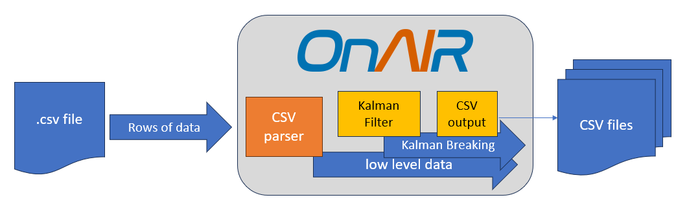

# Tutorial

This guide will show you how to run OnAIR in its default configuration, explains the configuration options, and add the included Kalman plugin.

Jump to "Tutorial: Using the Kalman Plugin" at the bottom to skip learning about things and just start making changes.

## Installation

You will need a Python environment (we test with 3.9 and newer) and the additional libraries listed in [environment.yml](../environment.yml).
We provide a [Dockerfile](../Dockerfile) which can be used directly to create a container to run OnAIR and also serves to document one possible installation.

Clone the OnAIR repo:

```
> git clone https://github.com/nasa/OnAIR.git OnAIR
> cd OnAIR
```

## First Run: Default Configuration

OnAIR includes some example data files, default configuration, and example plugin.

To run OnAIR:

`OnAIR> python driver.py`

You should see output to the console like this:

```
***************************************************
************    SIMULATION STARTED     ************
***************************************************

--------------------- STEP 1 ---------------------

CURRENT DATA: [946706400.0, 13.0, 3.0, 0.0, 2000.0, 0.0, 34.29, 0.0, 0.0]
INTERPRETED SYSTEM STATUS: ---

--------------------- STEP 2 ---------------------

CURRENT DATA: [946706401.0, 18.0, 5.0, -199.99, 1999.79, -0.41, 34.3, 0.0, 0.0]
INTERPRETED SYSTEM STATUS: ---

--------------------- STEP 3 ---------------------

CURRENT DATA: [946706402.0, 18.0, 5.0, -199.99, 1997.89, -1.8, 34.41, 0.0, 0.0]
INTERPRETED SYSTEM STATUS: ---

...
```

This will run OnAIR with the default configuration which loads a .csv file, steps through each row of data, and does nothing with it.

## Configuration File

The default configuration is [default_config.ini](../onair/config/default_config.ini).
Let's look at some of the parameters it sets.

### Telemetry file

```
TelemetryFilePath = onair/data/raw_telemetry_data/data_physics_generation/Errors
TelemetryFile = 700_crash_to_earth_1.csv
```

The TelemetryFilePath and TelemetryFile parameters tell OnAIR what data to load.
OnAIR is able to parse Comma Separated Value (.csv) files with the assumptions that the first row are the column names and all rows have the same number of cells.
Note that these parameters are ignored and can be left blank if you intend to run OnAIR with a live data source (see [redis_example.ini](../onair/config/redis_example.ini).

Here's a small snippet of [700_crash_to_earth_1.csv](../onair/data/raw_telemetry_data/data_physics_generation/Errors/700_crash_to_earth_1.csv):

```
Time,VOLTAGE,CURRENT,THRUST,ALTITUDE,ACCELERATION,TEMPERATURE,SCIENCE_COLLECTION,[LABEL]: ERROR_STATE
0:00,13,3,0,2000,0,34.29,0,0
0:01,18,5,-199.99,1999.79,-0.41,34.3,0,0
0:02,18,5,-199.99,1997.89,-1.8,34.41,0,0
0:03,18,5,-199.99,1995.73,-2.32,34.53,0,0
```

You'll notice that the ALTITUDE telemetry point eventually becomes 0, thus the file name.
This was an error condition for the simulated rocket 🔥.

### Meta File

```
MetaFilePath = onair/data/telemetry_configs/
MetaFile = data_physics_generation_CONFIG.json
```

Telemetry files provide the raw data for OnAIR to process; the meta files provide information about the raw data.
For example, a voltage telemetry point may have a range of acceptable values, noted as a FEASIBILITY test in this snipped of [data_physics_generation_CONFIG.json](../onair/data/telemetry_configs/data_physics_generation_CONFIG.json):

```
    "POWER": {
      "VOLTAGE": {
        "conversion": "",
        "tests": {
          "FEASIBILITY": "[12.9999, 18.1111]"
        },
        "description": "No description"
      },
```

The meta file also defines the order in which the telemetry points will be received in and additional information for live data sources such as the messages or channels that OnAIR needs to subscribe to for data.

### Data Source

`DataSourceFile = onair/data_handling/csv_parser.py`

This line defines the [on_air_data_source.py](../onair/data_handling/on_air_data_source.py) that will be used to ingest data into OnAIR.
The [csv_parser.py](../onair/data_handling/csv_parser.py) is a file-based data source that is used by the default configuration; [redis_adapter.py](../onair/data_handling/redis_adapter.py) and [sbn_adapter.py](../onair/data_handling/sbn_adapter.py) are live data sources that connect to an external publish/subscribe service to ingest data.
File-based sources are intended to process saved telemetry and allow for testable, repeatable experiments that are independent of control software.
Live sources are intended to allow OnAIR to pull data from a running system such as [NASA's cFS](https://github.com/nasa/cFS).

### Plugins

Finally we reach the plugin section which is at the heart of OnAIR.
This is where researchers can insert their own code to process data and generate higher level data products.
There are four plugin types, of which there can be multiple plugins instantiated.
Data is passed from OnAIR to the plugins as a frame of telemetry points at each time step, and data is passed between plugins as Python dictionaries.

Refer to the [Architecture](architecture.md) guide for more information.

In the default configuration, only a generic plugin that does no processing is used:

```
KnowledgeRepPluginDict = {'generic':'plugins/generic/__init__.py'}
LearnersPluginDict = {'generic':'plugins/generic/__init__.py'}
PlannersPluginDict = {'generic':'plugins/generic/__init__.py'}
ComplexPluginDict = {'generic':'plugins/generic/__init__.py'}
```

## Tutorial: Using the Kalman Plugin

In the default configuration, OnAIR doesn't do any processing of the data.
Now, we'll take a look at the Kalman example which processes frames of data with a Kalman Filter ([Wikipedia: Kalman Filter(https://en.wikipedia.org/wiki/Kalman_filter), [PyPI: simdkalman](https://pypi.org/project/simdkalman/)) in one plugin and outputs the results to a file using a second plugin.

### Kalman Configuration

The Kalman example configuration [kalman_csv_output_example.ini](../onair/config/kalman_csv_output_example.ini) has the following listed for Plugins:

```
[PLUGINS]
KnowledgeRepPluginDict = {'Kalman Filter': 'plugins/kalman'}
LearnersPluginDict = {'csv output':'plugins/csv_output'}
PlannersPluginDict = {}
ComplexPluginDict = {}
```

You can see that there is a KnowledgeRep plugin, Kalman Filter: this plugin will see the low-level data frame and use it to build up higher level information.
In this case, a list of telemetry points that have violated their Kalman filter prediction for a time step.
There is also a Learners plugin, csv output: normally a learner would use both the low-level data and the higher level information from Knowledge Representation plugins to make sense of the environment.
In this example we make the the csv output plugin a Learner so that it can see both the Kalman filter output and the low level data and write them to a file.

The image below shows the data flow from a csv file, into OnAIR, into the plugins (in yellow), and back out to csv files:



### Inside the Kalman Plugin

The Kalman Plugin [kalman_plugin.py](../onair/plugins/kalman/kalman_plugin.py) inherits from the abstract class [`AIPlugin`](../onair/src/ai_components/ai_plugin_abstract/ai_plugin.py) which requires two functions: `update` and `render_reasoning`.
`AIPlugin` also defines an `__init__` function which stores the plugin name and a list of names of the telemetry points in the low level data (called "headers").

The `update` function is how the plugin receives each new data frame:

```
    def update(self, low_level_data=None, _high_level_data=None):
        """
        Update the frames with new low-level data.

        This method converts the input data to float type, appends it to the
        corresponding frames, and maintains the window size by removing older
        data points if necessary.

        Parameters
        ----------
        low_level_data : list
            Input sequence of data points with length equal header dimensions.

        Returns
        -------
        None
        """
        if low_level_data is None:
            print_msg(
                "Kalman plugin requires low_level_data but received None.", ["FAIL"]
            )
        else:
            frame = floatify_input(low_level_data)

            for i, value in enumerate(frame):
                self.frames[i].append(value)
                if len(self.frames[i]) > self.window_size:
                    self.frames[i].pop(0)
```

This plugin simply stores the new data frame alongside a sliding window of previous data frames.
The data frames are actually processed in the `render_reasoning` function:

```
    def render_reasoning(self):
        """
        Generate a list of attributes that show fault-like behavior based on residual analysis.

        This method calculates residuals using the Kalman filter predictions and compares
        them against a threshold. Attributes with residuals exceeding the threshold are
        considered to show fault-like behavior, except for the 'TIME' attribute.

        Returns
        -------
        list of str
            A list of attribute names that show fault-like behavior (i.e., have residuals
            above the threshold). The 'TIME' attribute is excluded from this list even
            if its residual is above the threshold.

        Notes
        -----
        The residual threshold is defined by the `residual_threshold` attribute of the class.
        """
        residuals = self._generate_residuals()
        residuals_above_thresh = residuals > self.residual_threshold
        broken_attributes = []
        for attribute_index in range(len(self.frames)):
            if (
                residuals_above_thresh[attribute_index]
                and not self.headers[attribute_index].upper() == "TIME"
            ):
                broken_attributes.append(self.headers[attribute_index])
        return broken_attributes
```

The output of `render_reasoning` is a list that is passed to later plugins as high level data; the Kalman Plugin reports which telemetry points it has flagged as broken (e.g. out of the expected bounds of the Kalman filter's prediction).
This way you can build chains of more complicated behavior as plugins build on the results of earlier plugins while isolating specific functionality.
For example, you could write a plugin that attempts to diagnose faults based on what telemetry points have been flagged as broken by the Kalman filter and/or other fault detection algorithms.

### Output

Run the Kalman example with `python driver.py onair/config/kalman_csv_output_example.ini`.
The terminal should show similar output as the default run, but probably a little slower as OnAIR is actually doing something now.

The run should generate a file named `csv_out_[date/time].csv (the data/time is in the format of day of year, hour, minute).
It may generate multiple files if the execution spans multiple minutes.
This file has all of the data that was visible to the csv output plugin: low level data and the high level output from the Kalman plugin.

For most of the output, the Kalman plugin didn't flag any telemetry points as broken (which is good!).
This particular data file was generated with jumps in the current, so you should see some lines such as:

```
> cat cat csv_out_323_21_57.csv
--- snip ---
946689342.0,18.0,5.0,200.0,1834.2,2.46,43.76,0.0,0.0
946689343.0,18.0,5.0,200.0,1836.06,1.72,43.65,0.0,0.0
946689344.0,18.0,5.0,200.0,1837.82,1.52,43.55,0.0,0.0
946689345.0,18.0,2.0,200.0,1839.95,2.26,43.43,0.0,1.0,CURRENT
946689346.0,18.0,2.0,200.0,1841.78,1.66,43.33,0.0,1.0
946689347.0,18.0,3.0,200.0,1843.55,1.55,43.23,0.0,1.0
946689348.0,18.0,3.0,200.0,1845.57,2.05,43.11,0.0,1.0
946689349.0,18.0,5.0,200.0,1847.68,2.22,42.99,0.0,0.0,CURRENT
946689350.0,18.0,5.0,200.0,1849.88,2.41,42.86,0.0,0.0
946689351.0,18.0,5.0,200.0,1851.73,1.7,42.76,0.0,0.0
946689352.0,18.0,5.0,200.0,1853.62,1.79,42.65,0.0,0.0
--- snip ---
```

Here you see that the 3rd column (CURRENT) is steady at 5.0.
When it drops to 2.0, "CURRENT" is added to the output from the Kalman plugin.
This happens again when the current jumps again from 3.0 to 5.0.

Note: The Kalman filter is not detecting faults, just telemetry points that are outside of the expected range given the filter's configuration and previous readings.
This _may_ indicate a fault; further analysis should be done by a human or higher level plugin.

## Write a New Plugin

Now we are going to write a new plugin to "scream" every time a telemetry point has been marked as broken by the Kalman plugin.

First we need to create a directory and files for the plugin.
The easiest way to do this is to just copy the generic plugin directory.
Note: the plugin directory can be placed anywhere; you just have to update your configuration (.ini) file with the correct location.
I will keep things in the plugin directory to make this simple, but you may not want to mix the your custom plugin source code with the rest of OnAIR's code.

```
- from top level OnAIR directory -
> cd plugins
> cp -r generic scream
> mv scream/generic_plugin.py scream/scream_plugin.py
```

Create a new configuration file; we'll base ours off of the Kalman example we just used.

```
- from top level OnAIR directory -
> cd onair/config
> cp kalman_csv_output_example.ini scream_example.ini
```

Now edit `scream_example.ini` to have a Complex Reasoner plugin by changing this:

```
ComplexPluginDict = {}
```

to this:

```
ComplexPluginDict = {'Scream': 'plugins/scream'}
```

Run OnAIR with your new config to confirm that there are no errors (behavior should be the same as the Kalman example since your new plugin doesn't do anything yet).

Now edit `scream_example.py`:

```
from onair.src.ai_components.ai_plugin_abstract.ai_plugin import AIPlugin


class Plugin(AIPlugin):
    def update(self, low_level_data=[], high_level_data={}):
        """
        Given streamed data point, system should update internally
        """
        if not 'Kalman Filter' in high_level_data['vehicle_rep']:
            print("No 'Kalman Filter' plugin! Scream has nothing to scream about.")
        else:
            broken_telemetry_points = high_level_data['vehicle_rep']['Kalman Filter']
            if len(broken_telemetry_points) > 0:
                print("AHHHHHHHHHHHHHHHHHHHHHHHHHHHHHHHHHHHHH")
                print("Everything is messed up! Specifically:")
                print(broken_telemetry_points)
                print("AHHHHHHHHHHHHHHHHHHHHHHHHHHHHHHHHHHHHH")

    def render_reasoning(self):
        """
        System should return its diagnosis
        """
        pass
```

Normally the `update` function is use to process incoming data and the `render_reasoning` function is used to produce and return the plugin's output.
Here we do everything in the `update` function for simplicity (and scream doesn't actually have anything useful to pass on to other plugins).
First we check that the high level data does in fact have an entry named "Kalman Filter", which is the name of the Kalman plugin in the config file.

Next, the plugin checks the Kalman plugins rendered output (`high_level_data['vehicle_rep']['Kalman Filter']` is the list returned by the Kalman plugin's `render_reasoning` function).
If something is there, the scream plugin will, well, scream about it.

When you run your scream example, you should now see the following among the output:

```
--- snip ---

--------------------- STEP 943 ---------------------

CURRENT DATA: [946689342.0, 18.0, 5.0, 200.0, 1834.2, 2.46, 43.76, 0.0, 0.0]
INTERPRETED SYSTEM STATUS: ---

--------------------- STEP 944 ---------------------

CURRENT DATA: [946689343.0, 18.0, 5.0, 200.0, 1836.06, 1.72, 43.65, 0.0, 0.0]
INTERPRETED SYSTEM STATUS: ---

--------------------- STEP 945 ---------------------

CURRENT DATA: [946689344.0, 18.0, 5.0, 200.0, 1837.82, 1.52, 43.55, 0.0, 0.0]
INTERPRETED SYSTEM STATUS: ---
AHHHHHHHHHHHHHHHHHHHHHHHHHHHHHHHHHHHHH
Everything is messed up! Specifically:
['CURRENT']
AHHHHHHHHHHHHHHHHHHHHHHHHHHHHHHHHHHHHH

--------------------- STEP 946 ---------------------

CURRENT DATA: [946689345.0, 18.0, 2.0, 200.0, 1839.95, 2.26, 43.43, 0.0, 1.0]
INTERPRETED SYSTEM STATUS: ---

--------------------- STEP 947 ---------------------

CURRENT DATA: [946689346.0, 18.0, 2.0, 200.0, 1841.78, 1.66, 43.33, 0.0, 1.0]
INTERPRETED SYSTEM STATUS: ---

--------------------- STEP 948 ---------------------

CURRENT DATA: [946689347.0, 18.0, 3.0, 200.0, 1843.55, 1.55, 43.23, 0.0, 1.0]
INTERPRETED SYSTEM STATUS: ---

--------------------- STEP 949 ---------------------

CURRENT DATA: [946689348.0, 18.0, 3.0, 200.0, 1845.57, 2.05, 43.11, 0.0, 1.0]
INTERPRETED SYSTEM STATUS: ---
AHHHHHHHHHHHHHHHHHHHHHHHHHHHHHHHHHHHHH
Everything is messed up! Specifically:
['CURRENT']
AHHHHHHHHHHHHHHHHHHHHHHHHHHHHHHHHHHHHH

--------------------- STEP 950 ---------------------

CURRENT DATA: [946689349.0, 18.0, 5.0, 200.0, 1847.68, 2.22, 42.99, 0.0, 0.0]
INTERPRETED SYSTEM STATUS: ---

--------------------- STEP 951 ---------------------

CURRENT DATA: [946689350.0, 18.0, 5.0, 200.0, 1849.88, 2.41, 42.86, 0.0, 0.0]
INTERPRETED SYSTEM STATUS: ---

--- snip ---
```
